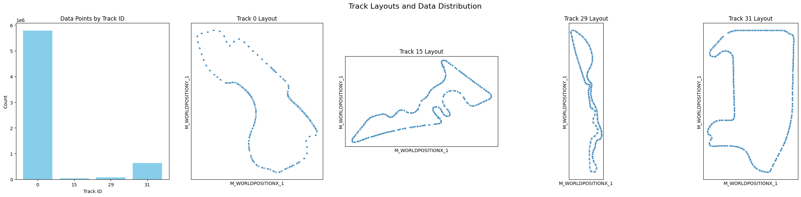
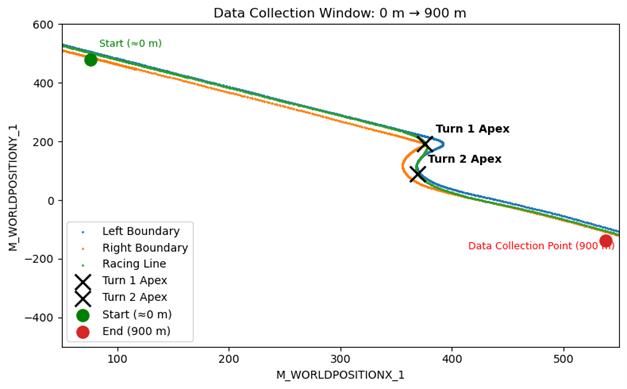
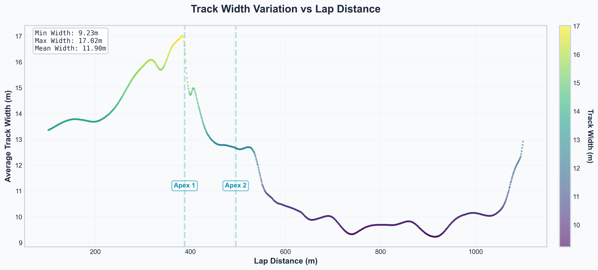
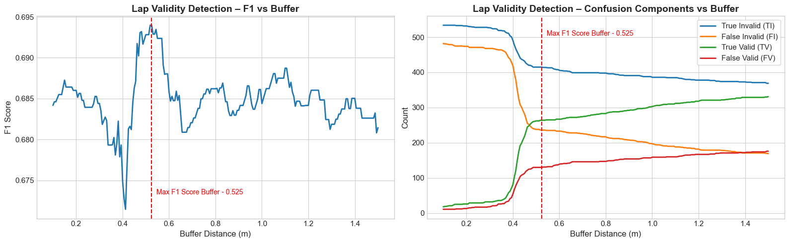
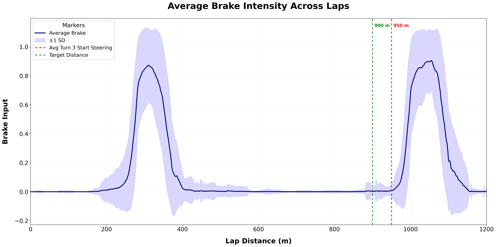
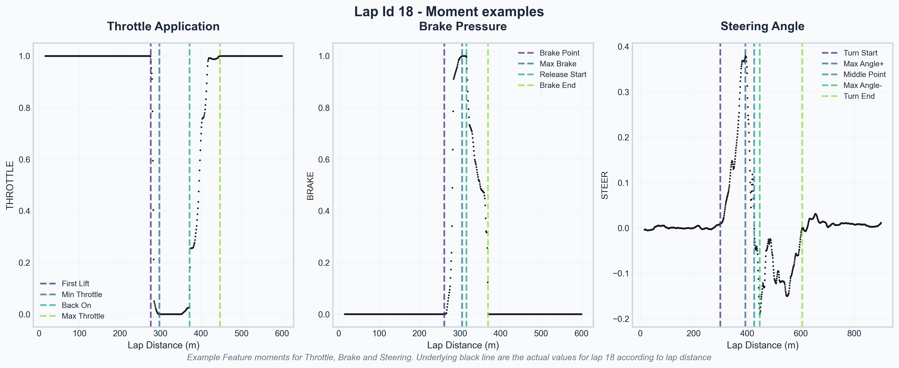

# ApexRacing

**A data-driven analysis of telemetry-based performance in F1 simulation racing, investigating optimal behavioural car metrics through Turns 1 and 2 of Melbourne Albert Park circuit.**

---

## 1. Project Description  

Performances in motorsports are dictated by a range of key factors regarding the braking, turning and throttle of the vehicle, where each plays a critical role in determining the final lap time. Often shaped by the split-second decisions made by drivers at specific sections of the track, turns are one such crucial point as they present opportunities for overtaking. As even microsecond differences can dictate differences in these outcomes, minimising the time required to pass through these zones becomes essential, especially in competitive contexts such as Formula One races.

Previous research on optimal driving strategies has often relied on simple simulations or narrow datasets. In this project, we analyse a **Formula One simulation** with a high-resolution dataset capturing vehicle behaviour through Turns 1 and 2 at the Melbourne Albert Park circuit. Our primary aim is to determine the optimum behavioural car and driving conditions at which the vehicle exits Turn 2, based on the time to reach a fixed distance point marginally further down the track (900m).

The setup involves acquiring multiple reference datasets describing the race circuit and lap performance. The proposed final dataframe integrates these into engineered lap-level features, capturing key performance indicators (braking point, throttle point, etc) alongside aggregated measures (e.g. total throttle applied within defined segments) to further complement the evaluation of performances. These tasks highlight a significant initial step in bridging the gap between model driven optimisation and real-world telemetry analysis in the modern motorsport landscape.

---

## 2. Dataset  

### 2.1. Sources  

Our project uses several **Jupyter Notebooks** for analysis and visualization, and **Python files** for building the complete dataset.  

Data sources include:  

- **UNSW F12024**: large-scale dataset of F1 racing lap performance  
- **f1sim-ref-left**: left track boundaries  
- **f1sim-ref-right**: right track boundaries  
- **f1sim-ref-turns**: corner and apex reference points  
- **f1sim-ref-line**: ideal racing line  

### 2.2. Data Description  

#### 2.2.1. Final Data Product Description

The final data product is a lap-level dataset, with each row representing a single lap attempted by a driver (~500–1000 rows total) with the `lap_id` feature being a concatenation of `SESSION_GUID` and the lap number. Features summarise key aspects of lap execution (e.g. braking, throttle, steering, speed, and segment-based performance), aligned to track geometry and specific race segments. The dataset is designed to capture both overall lap characteristics and driver–track interactions, with the target variable being lap time.

- **Observations (rows):** one per lap, across all drivers (~500–1000 total)
- **Features (columns):** engineered summaries of braking, throttle, steering, speed, and sector performance
- **Target variable:** lap time at a point, 900m (See section 3.5.3)
- **Usage:** compare driver performance, model lap outcomes, and evaluate optimal racing strategies

#### 2.2.2. Table of Features

The following documentation expands on our engineered features by defining two key layers of our feature design - **Moments** and **Attributes** - and illustrate how these interact in our dataframe.

#### <u>Moments</u>

**Moments** represent key behavioural or mechanical events that occurs during a lap. For instance, when a driver first applies the brake, releases the throttle, or reaches the midpoint of a turn. These reference points are used to anchor subsequent calculations to measure timing, distance, and performance changes through each section of the track. An exmaple of some of the moments can be seen in *Figure. 5*.

| **Type of Moment** | **Moment** | **Code Pattern / Prefix** | **Time-to-Extrema** | **Description** |
|--------------------|------------------------|-----------------------|--------------------|----------------|
| Variable | First Brake | `BPS` | Yes | Captures the point at which braking is first initiated before Turn 1 or 2 |
| Variable | End Brake | `BPE` | Yes | Marks the release of braking input |
| Variable | Start Steering | `STS` | Yes | Identifies the first notable steering input, signalling the driver’s approach to turn-in |
| Variable | End Steering | `STE` | Yes | Captures the point where steering angle returns to neutral after a turn |
| Variable | Middle Turning Point | `STM` | No | Represents the midpoint of steering angle |
| Variable | Off Throttle | `THE` | Yes | Indicates when the driver fully releases throttle before entering a corner |
| Variable | Start Throttle | `THS` | Yes | Marks the moment throttle is reapplied after corner exit |
| Fixed | Apex (actual) | `APX1`, `APX2` | No | Defines the true geometric apex points of Turns 1 and 2 |
| Fixed | Distances | `dist_360`, `dist_430`, `dist_530`, `Target` | No | Reference points at lap distances 360m, 430m and 530m and Target at 900m |

Overall, these **Moments** define the critical phases of vehicle behaviour during Turns 1–3 and are used as anchor points for deriving further measurements.

#### <u>Attributes</u>

**Attributes** describe *what* is being measured at or around each Moment. They capture the car’s physical and temporal states (position, distance, steering angle) to quantify how the driver’s input changes through each phase.

| **Attribute** | **Code Pattern / Suffix** | **Type / Shape** | **Description** |
|----------------|---------------------------|------------------|-----------------|
| Lap distance | `*_LAPDISTANCE` | Scalar (m) | Linear distance travelled at each moment |
| Position X/Y, Forward vector | `*_WORLDPOSITION(X/Y)`, `*_WORLDFORWARDDIR(X/Y)` | Scalar | Car coordinates used to reconstruct trajectories |
| Timestamp / Lap time | `*_CURRENTLAPTIMEINMS` | Scalar (ms) | Captures temporal alignment of events |
| Relative displacement | `*_proj_from_ref`, `*_(left/right)_dist` | Scalar (m) | Perpendicular offset from reference racing line or track edge |
| Distance to apex | `*_dist_apex_1`, `*_dist_apex_2` | Scalar (m) | Euclidean distance from car position to turn apex |
| Angle to apex | `*_angle_to_apex1`, `*_angle_to_apex2` | Angular | Angular offset between car heading and apex vector |
| Steering angle | `*_STEER` | Angular | Direction and intensity of steering input |
| Steering angle | `*_SPEED` | Scalar (km/h) | Speed of car in km/h |
| Steering angle | `*_BRAKE` | Scalar (0-1) | Intensity of brake input |
| Steering angle | `*_THROTTLE` | Scalar (0-1) | Intensity of throttle input |
| Time to extrema | `*_ext_TIMETOINMS`, `*_ext_LAPDISTANCE` | Scalar | Time difference / lap distance between current frame and the feature’s peak event |
| Rotational forces | `*_PITCH`, `*_YAW`, `*_ROLL` | Scalar | Captures vehicle rotation around each axis to analyse corner dynamics |

#### <u>How to Read</u>

The **Moments** and **Attributes** tables are designed to be read together. Each feature in the engineered dataset is formed by combining a **Moment code Prefix** (indicating *when* the measurement occurs) with an **Attribute suffix** (indicating *what* is being measured).  

For example:

- **`BP_STEER`** - steering angle recorded at the **First Brake** moment
- **`THS_dist_apex_1`** - distance from the car to the first apex when **Start Throttle** occurs
- **`STM_YAW`** - yaw rotation (rate of directional change) measured at the **Middle Turning Point**
- **`THE_ext_TIMETOINMS`** - time to peak deceleration from the **Off Throttle** event

This modular naming convention ensures every feature is able to be interpreted and traced back to its functional purpose within the lap.

By following this convention, users may efficiently locate, filter, and compare driver performance metrics across moments, laps, and turns, enabling consistent and replicable analysis across future model iterations.

#### 2.2.3. Incoming and Cleaned Data Description

The incoming telemetry contains frame-level observations of driver and vehicle state (speed, throttle, steering, braking, gear, RPM, world position, lap/sector times). These raw data are cleaned, synchronised, and aligned with the track, then aggregated into lap-level summaries that form the basis of the final dataset.

- **Observations (rows):** vehicle state at each recorded frame/step of the lap
- **Features (columns):** raw telemetry (speed, throttle, steering, braking, gear, RPM, position, times)
- **Target variable:** not defined at frame level; derived later through aggregation into lap/sector time
- **Usage:** preprocessed and aggregated to generate lap-level summaries for the final dataset

| Description                | Variables                                                                                                                                | Features               | Usage                                                                                    |
| ----------------------------- | ---------------------------------------------------------------------------------------------------------------------------------------- | ---------------------- | ---------------------------------------------------------------------------------------- |
| **Session Identifiers**       | `SESSION_GUID`, `M_SESSIONUID`, `R_SESSION`, `R_NAME`, `R_STATUS`, `M_TRACKID`                                                           | Categorical/Text       | Groups laps/runs; links telemetry to results/metadata; filters by track/session context |
| **Lap Data**                  | `M_CURRENTLAPNUM`, `M_CURRENTLAPNUM_1`, `M_CURRENTLAPINVALID_1`, `LAPTIME`, `CURRENTLAPTIME`, `M_CURRENTLAPTIMEINMS_1`                   | Discrete/Binary/Time   | Lap segmentation, filtering invalid laps, and benchmarking performance                  |
| **Driver Inputs**             | `M_THROTTLE_1`, `M_BRAKE_1`, `M_STEER_1`, `M_GEAR_1`, `M_FRONTWHEELSANGLE`, `M_DRS_1`                                                    | Continuous/Categorical | Evaluates acceleration, braking, cornering, gear shifts, and DRS use                    |
| **Speed & Engine**            | `M_SPEED_1`, `M_ENGINERPM_1`                                                                                                             | Continuous             | Core performance measures; assess acceleration, straight-line speed, and shift points   |
| **Brake Temperatures**        | `M_BRAKESTEMPERATURE_FL_1`, `M_BRAKESTEMPERATURE_FR_1`, `M_BRAKESTEMPERATURE_RL_1`, `M_BRAKESTEMPERATURE_RR_1`                           | Continuous (°C)        | Thermal load and braking efficiency; detects imbalance/overheating                      |
| **Tyre Pressures**            | `M_TYRESPRESSURE_FL_1`, `M_TYRESPRESSURE_FR_1`, `M_TYRESPRESSURE_RL_1`, `M_TYRESPRESSURE_RR_1`                                           | Continuous (psi/kPa) | Grip and stability; monitors balance and traction                                       |
| **Distances**                 | `M_LAPDISTANCE_1`, `M_TOTALDISTANCE_1`                                                                                                   | Continuous (m)         | Aligns telemetry with track position; cumulative mileage tracking                       |
| **World Position (Car)**      | `M_WORLDPOSITIONX_1`, `M_WORLDPOSITIONY_1`, `M_WORLDPOSITIONZ_1`                                                                         | Continuous             | 3D trajectory mapping for racing line, elevation, and kerbs                             |
| **World Orientation Vectors** | `M_WORLDFORWARDDIRX_1`, `M_WORLDFORWARDDIRY_1`, `M_WORLDFORWARDDIRZ_1`, `M_WORLDRIGHTDIRX_1`, `M_WORLDRIGHTDIRY_1`, `M_WORLDRIGHTDIRZ_1` | Continuous             | Car heading/orientation in 3D space; used in angle-to-apex, yaw/roll calculations       |
| **Car Angles**                | `M_YAW_1`, `M_PITCH_1`, `M_ROLL_1`                                                                                                       | Continuous (degrees) | Captures rotation dynamics - heading, dive/squat, and body roll                         |
| **Track Reference Data**      | `FRAME`, `WORLDPOSX`, `WORLDPOSY`, `APEX_X1`, `APEX_Y1`, `CORNER_X1…Y2`, `TURN`                                                          | Mixed                  | Defines track geometry, apex points, corners, and reference frames                      |
| **Engineered Features**       | `dist_apex_1`, `dist_apex_2`, `angle_to_apex1`, `angle_to_apex2`, `track_width`, `left_dist`, `right_dist`, `l_width`, `r_width`, `in`   | Continuous/Binary      | Derived metrics for racing line, corner approach, and track usage evaluation            |

### 2.3. Assumptions  

- **Baseline assumptions:** derived from client consultation (Stuart, Oracle)
  - Flying Lap Start: The first measured lap in the telemetry is assumed to be a flying lap. Data collection begins with the vehicle already moving ( $\approx$ 0 m lap distance) and at racing speed, not from a standing start or pit exit.
  - Reference Line Validity: The provided f1sim-ref-line ideal racing line is not taken as the fastest possible route for every driver, but rather as a geometric reference (as advised by Stuart, Oracle).

- **Data cleaning assumptions:**  
  - Remove irrelevant tracks  
  - Remove NaNs in car coordinates  
  <!-- - Filter slower drivers (>75th percentile until Turn 3)   -->

---

## 3. Workflow  

The workflow for this project:  

### 3.1. Data acquisition  

We began by ingesting multiple reference raw datasets that describe the Albert Park circuit:

- The left and right track boundaries (*f1sim-ref-left.csv, f1sim-ref-right.csv*)
- A reference racing line (*f1sim-ref-line.csv*)
- Apex point data and area for each corner (*f1sim-ref-turns*).

 These were combined with the UNSW F1 2024 lap telemetry dataset (UNSW F12024.csv), which contains detailed information about driver inputs (throttle, braking, steering) and car dynamics (speed, gear, RPM, position).  

### 3.2. Data and Cleaning

We began by cleaning the data, first removing unnecessary columns and renaming the remaining columns for clarity. The dataset also contained laps from tracks that were not part of our analysis (see figure 1).  

|  |
|:--:|
| *Figure 1. Number of data points per track, with approximate track ID layouts.* |

We therefore removed all data from tracks other than Albert Park, and further excluded datapoints beyond Turn 3, since our focus is on Turns 1 and 2 and the overtaking section between Turns 2 and 3. This was done by filtering for laps with a current lap distance below 1200m. Note that this distance exceeds the target lap point of 900m, allowing us to conduct both exploratory data analysis (EDA) to determine why 900m was optimal, as well as perform linear interpolation around this point.

Finally, we performed checks to handle missing values in the dataset, primarily for the car position variables. Rows with missing coordinates totalled around 68,000.

Further laps were removed as discussed in the *Removing unsuitable laps* section.

### 3.3. Track visualisation  

To verify the data and provide context for later analysis, we reconstructed the circuit by plotting the left and right boundaries alongside the reference racing line. Apex points were overlaid, and corners were annotated. We then produced zoomed-in visualisations of Turns 1 and 2, since these form the core section of interest.  

|  |
|:--:|
| *Figure 2. Track path from the start of the lap to data collection point* |

### 3.4. Removing unsuitable laps

- Removing rows with less than N 900 data points so features could be constructed cleanly (All laps bellow this number had large gaps)
- Removing laps where lap max distance between points become too great -> inaccuracy
- Removing laps where the target lap time could not be interpolated due to missing measurement points before and/or after the 900m lapdistance

### 3.5. Feature engineering  

#### 3.5.1. Track Width

We calculated the track width at each point along the circuit as a new feature. Using the reference datasets for the left and right track boundaries, we computed the Euclidean distance between corresponding points on each side of the track.  

This feature serves two purposes:  

1. It provides a spatial context for the car’s position along the track.  
2. It is used in off-track detection by comparing a car’s perpendicular distance from the track edges against the track width plus a buffer representing half the car’s width.  

|  |
| :-: |
| *Figure 3. Track width near corner* |

This method was also used to calculate the *ref-line feature*; how far the car was to the sample reference line given. This was done according to the paper by Jain and Morari in 2020<sup>(1)</sup> in which they used Bayesian optimisation to compute the optimal racing line compared to the given trajectory of the car. This can be used to determine whether the provided reference line is truly the optimum racing line.

#### 3.5.2. Off track

To identify when cars went off track, we calculated each car’s perpendicular distance from both the left and right track boundaries and summed these distances. If the total distance exceeded the width of the track at that point, plus a buffer accounting for the car’s width, the car was considered off track.  

Since the provided coordinates do not account for the car’s physical width, we needed to choose an appropriate buffer. The dataset included an `INVALID_LAP` flag indicating whether the car went off track at any point in the lap. We used this flag to test different buffer values and selected the one that maximized the F1 score (Balancing false positives and false negatives) representing what is most likely the same buffer width used in the races / game simulation.

|  |
| :-: |
| *Figure 4. Comparison of predicted lap validity (buffer-based) against official lap invalid flags across different buffer distances*|

#### 3.5.3. Target distance

We chose the target lap distance 900 to be the point where we determine drivers’ time. Since we used linear interpolation of lap distance covered to determine when the driver reaches the target lap distance, the most accurate section between turn 2 and 3 for us to consider for the target lap distance would be the latter half. The reasoning is that the rate of change in acceleration and speed during the exit from turn 2 would be high which in turn would result in the rate of change in lap distance to also be high causing uneven distances between measurement points. This would lead to a less accurate linear interpolation result relative to the latter half since the rate of change in acceleration and speed plateaus and thus results in more even distances between measurement points improving the accuracy of the linear interpolation. We also plotted a brake vs lap distance plot for our subset of drivers and found that majority of drivers begin braking for turn 3 around the lap distance 950. To ensure that our interpolation function does not get influenced by the braking and distances between measurement points, we choose the target lap distance to be 900.

|  |
| :-: |
| *Figure 5. Visualization of aggregate braking input patterns along the sampled track distance*|

It is also to note that by choosing a later point, rather than just after Turn 2, we optimise two objectives simultaneously: maximising exit speed from the corner and minimising the elapsed time to complete the run into Turn 3. This works because exit speed and segment time are inherently linked being inversely proportional, so optimising the target point jointly improves both objectives simultaneously.

### 3.6. Moment Engineering

We constructed new features to capture driver behaviour and vehicle dynamics more explicitly. These include braking and acceleration zones, steering angles, and measures of cornering precision. Each feature was designed as a separate transformation so that the pipeline can flexibly add or remove features depending on modelling needs.

|  |
| :-: |
| *Figure 6. Moment examples of throttle, break and steering*|

#### 3.6.1 Linear interpolation

To construct moments corresponding to lap distances that were not explicitly defined (e.g., the moments at 360 m, 430 m, 530 m, the target of 900 m, and the midpoint of the turn), linear interpolation was applied. The two closest points to the target distance were identified, and their values were used to estimate the intermediate moment through a weighted linear combination based on their relative distances. Likewise, linear interpolation was used to determine the steering angles between turn 1 and 2 as well as after turn 2.

#### 3.6.2 Braking points

We constructed 4 new features using the BRAKE measurements. We attained the lap distance for when the driver engaged maximum braking (`STM`) over the lap distance range between 10 and 800. To find the initial braking point (`BPS`), we used the maximum braking point to backtrack and find the lap distance when the `BRAKE` variable is 0. If there is no data for when `BRAKE` is 0, then the last point before maximum braking point is used and otherwise given a NaN value. We attained the lap distance where the driver disengages from maximum braking by finding the last measurement before the drop in `BRAKE` from maximum. The lap distance for when the driver completely stops braking (`BPE`) was found by the first measurement where `BRAKE` is 0 after the drop from maximum braking. This can be seen in the `BRAKE` section of *Figure 6*.

#### 3.6.3 Steering points

We constructed 5 new features using the `STEER` measurements. We attained the lap distance for maximum positive angle and the maximum negative angle for each lap by finding the maximum and minimum value of `STEER` respectively. To find the initial steering for turn 1 (`STS`), we used the maximum positive angle point to backtrack and find the lap distance of the first measurement when the `STEER` variable is less than 0.01. We did not use the points where `STEER` is zero to take into account slight changes drivers made on the straight before turn 1. The lap distance where the driver returned back to the angle being 0 (`STM`) was found by detecting when the sign changes in the steer angle for measurements between the maximum positive angle and the maximum negative angle. Then the two points around the change were used to linearly interpolate the lap distance around which the steering would have been 0. The lap distance for when the steering angle returns to 0 after turn 2 (`STE`) was calculated exactly the same way as `STM`. This can be seen in the `STEERING` section of *Figure 6*.

#### 3.6.4 Throttle moments

For the throttle moments and extract key throttle-related moments from each lap, we developed the `get_throttle_points` function. For each lap, we identify when the driver first lifts off the throttle (`THE`), the minimum throttle reached afterwards, when they begin reapplying throttle (`THS`), and when throttle returns to its maximum. These points capture important aspects of driver behaviour, such as corner entry, mid-corner control, and corner exit. A small lift threshold was used to filter out minor fluctuations while preserving meaningful changes, and any laps with missing throttle data are still included to retain other useful features. This can be seen in the `THROTTLE` section of *Figure 6*.

This was done by first sorting each lap by distance and restricting the analysis to a specified distance range (Near the turn). Differences in consecutive throttle values were then computed to detect lift-offs and reapplications, and the corresponding lap distances for minimum and maximum throttle points were recorded for each lap. (We used a threshold value of 0.02 to avoid noise).

#### 3.6.5. Apex moments

Each lap’s apex moments were determined by identifying the points closest to each of the two apexes. The lap distances at these points were then recorded as unique identifiers for their corresponding lap, serving as the reference for generating the complete moment dataset.

### 3.6.6. Other notes

We aimed to create a Velocity vs Tire Direction feature representing the difference between the vehicle’s velocity vector and tire direction. However, this was not feasible due to missing or null velocity vector data, preventing reliable construction of the feature.

Some cells in the final dataset remain NaN, as certain laps lacked specific data such as braking or throttle inputs. These laps were retained since they still contain valuable information that can be leveraged in modelling. Any further handling of missing values can be efficiently performed during the modelling stage.

Finally, invalid laps (where the car went off track) were also retained and marked with a dedicated flag to preserve potentially useful behavioural and contextual data.

### 3.7. Analysis and modelling (planned)  

The next step is to evaluate driver performance through Turns 1–3, comparing how different inputs (braking, throttle, steering) impact lap time / speed / **(TBA - THEORY)**.

Future work may focus on developing models that examine the impact of individual telemetry features on lap outcomes with the objective of isolating key performance indicators. These models could then be applied across drivers to depict variations in factors such as braking strategy, throttle application and racing lines. Following this analysis, a comprehensive evaluation of driving efficiency can be conducted to pinpoint the exact areas in which performance gains are realised.

---

## 4. Research 

- Conducted literature review on driver behaviour, braking/throttle strategies, and racing simulations  
- Identified limitations in existing studies such as the paper by Struthers called Formula One Telemetry Analysis<sup>(2)</sup> where research focused more on use of microprocessors in the Formula 1 simulator for data analysis and data structure construction for real time data graphs rather than analysis and modelling for improved lap performance.

---

## 5. Usage  

This product is intended for:  

- Analysis of driver performance in key track sections  
- Exploration of braking/acceleration patterns  
- Simulation of optimal racing strategies  

Future work may include:  

- Integrating external racing telemetry datasets  
- Building interactive simulations
- Creating new features
- Building models various different models to determine optimum racing conditions such as:
    - Regression models to predict the finish time e.g Linear Regression or Random Forest based on features of steering, braking, throttle etc.
    - Classification models to classify laps based on performance e.g fast, fair, slow
    - Time Series Analysis for drivers who completed multiple laps to determine how performance changes over increased number of laps

To get the final dataset run the python file "run_pipeline" ensuring the required data in within the data folder, see `config.py`.

```
data/UNSW F12024.csv
data/f1sim-ref-left.csv
data/f1sim-ref-right.csv
data/f1sim-ref-line.csv
data/f1sim-ref-turns.csv
```

---

## 6. Contributors  

- **Data Transformation:** Charlotte Fang Hendro, Christian Joel, Eric Kim, Muhammad Ijaz, Samuel Katz  
- **Data Source:** Oracle – Stuart Coggins  
- **Guidance & Education:** Dr Jakub Stoklosa  

If you’d like to contribute:  

- Explore additional factors influencing lap time  
- Generate new features from existing data  
- Build simulations to test strategies  
- Integrate external datasets

---

## 7. Support  

For questions or suggestions, contact:  

- Charlotte Fang Hendro – <z5363431@ad.unsw.edu.au>  
- Christian Joel – <z5257354@ad.unsw.edu.au>  
- Eric Kim – <z5478624@ad.unsw.edu.au>  
- Muhammad Ijaz – <z5417537@ad.unsw.edu.au>  
- Samuel Katz – <z5479193@ad.unsw.edu.au>  

---

## 8. References

 1. Jain, A. and Morari, M. (2020). Computing the racing line using Bayesian optimization, Cornell University Available at: <https://arxiv.org/abs/2002.04794>
 2. Struthers, A. (2022). Formula One Telemetry Analysis, Central Washington University. Available at: <https://digitalcommons.cwu.edu/source/2022/COTS/99/>.

‌


